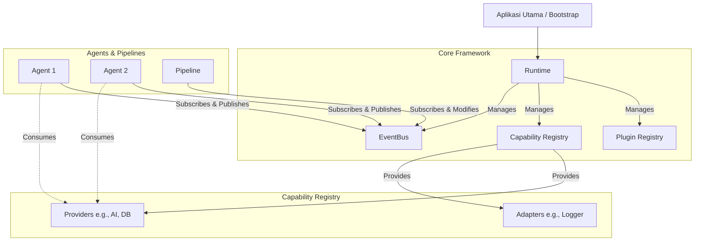

# Arsitektur Framework

`@agent-runtime/core` dibangun di atas arsitektur **Event-Driven, Plugin-Oriented**.

## Gambaran Besar

## Komponen Utama

### 1. `Runtime`
Ini adalah "otak" pengelola sistem. Ia tidak memproses logika bisnis apa pun. Tugasnya murni untuk mengatur _Dependency Injection_, memicu _Lifecycle Hooks_, dan menjalankan (start) / mematikan (stop) sistem secara *graceful*.

### 2. `EventBus`
Ini adalah infrastruktur *Pub/Sub*. `EventBus` menggunakan `EventBusAdapter` di bawah kap mesin (secara default `InMemoryAdapter`, namun bisa diganti dengan `RedisAdapter` atau Kafka melalui sistem Plugin). Seluruh event harus mematuhi format kontrak `RuntimeEvent`.

### 3. `Agent`
Agen adalah *state-less worker*. Bayangkan mereka seperti microservices kecil yang berlari di dalam node yang sama. Setiap agen hanya peduli pada *input event* dan memproduksi *output event*. 
*Agen yang baik tidak memanggil agen lain secara langsung (No RPC).*

### 4. `Pipeline`
Digunakan ketika Anda membutuhkan transformasi event secara sekuensial sebelum event tersebut diolah oleh agen bisnis. (Misalnya: validasi payload, pengayaan data pengguna, atau filtrasi spam).

### 5. `Plugins`
Setiap library eksternal (Redis, OpenAI, Stripe) masuk ke dalam framework melalui antarmuka `RuntimePlugin`. Plugin diizinkan untuk mendaftarkan `Adapter` atau `Provider` ke dalam Capability Registry.
