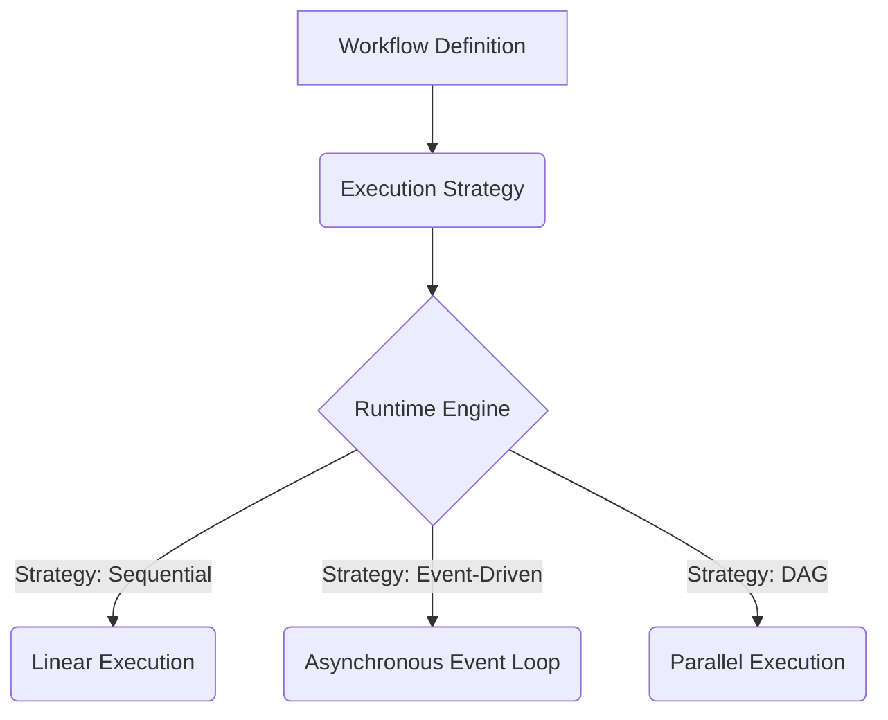
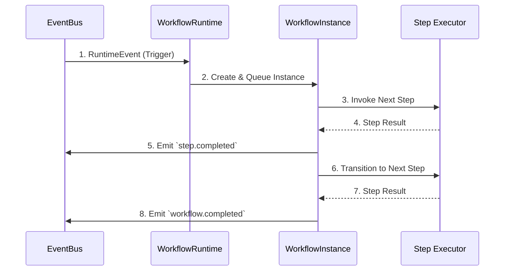

# RFC: 0006 - Workflow Runtime Architecture

- **Status:** Accepted
- **Author:** anggi1991 (Ecosystem Maintainer)
- **Date:** 2026-08-03

## 1. Ringkasan (Summary)
RFC ini merumuskan arsitektur dasar untuk **Workflow Runtime** (v0.4). Tujuannya adalah merancang mekanisme orkestrasi yang kokoh untuk agen dan layanan, dengan memisahkan konsep definisi alur kerja (*Definition*) dari status eksekusinya (*Instance*). RFC ini juga menetapkan batasan yang jelas antara orkestrasi eksekusi (v0.4) dan ketahanan *state* (v0.5).

---

## 2. Definisi Istilah Inti

Agar tidak ada ambiguitas dalam desain dan implementasi ke depan, berikut adalah terminologi resmi yang akan digunakan:

- **Workflow**: Sebuah cetak biru (*blueprint*) abstrak yang menggambarkan serangkaian aktivitas atau langkah logika bisnis.
- **Step**: Unit komputasi di dalam Workflow yang memiliki kontrak tegas berupa: **Input**, **Execute**, **Output**, dan **Metadata** (misal: LLM Step, HTTP Step, Approval Step, Delay Step).
- **Transition**: Aturan atau jalur perpindahan yang menentukan Step mana yang akan dieksekusi setelah sebuah Step selesai (atau gagal). Transisi bisa memiliki **Condition**, **Guard**, **Error Path**, dan **Default Path** untuk mengakomodasi percabangan.
- **Execution**: Aksi memproses sebuah *Workflow Instance* melalui urutan transisi hingga mencapai status terminal (selesai/gagal/dibatalkan).

---

## 3. Workflow Definition vs Workflow Instance

Pemisahan ini adalah hukum dasar dalam v0.4.

- **Workflow Definition**: Bersifat *stateless* dan statis. Mendefinisikan graf atau urutan langkah-langkah. Definisi hanya dibuat satu kali (misal: `Purchase Approval Workflow`).
- **Workflow Instance**: Bersifat *stateful* dan dinamis. Merupakan representasi dari satu sesi eksekusi atas suatu Definisi. Contoh: `Purchase Approval #12345`. Instance ini yang memiliki *ID unik*, melacak *current step*, dan menyimpan *payload/context*.

Pemisahan ini mutlak agar *State Management* di v0.5 nanti memiliki entitas konkret (`Workflow Instance`) untuk disimpan ke dalam *database*.

---

---

## 4. Prinsip Desain

**Workflow Runtime is deterministic.**
Artinya: Dengan *Definition* yang sama, *Context* yang sama, dan *Event* yang sama, hasil *Workflow* harus sama. Prinsip deterministik ini mutlak untuk menjaga konsistensi eksekusi antar *Instance*.

---

## 5. Workflow Context

*Workflow Instance* membutuhkan *payload* dan *state*. Agar tidak setiap *Step* merakit konteksnya secara acak, arsitektur ini membagi konteks ke dalam hierarki berikut:

- **Global Context**: Konfigurasi tingkat mesin/sistem yang dibagikan antar *Workflow*.
- **Workflow Context**: Konteks utama (*payload*) dari *Workflow Instance* yang dipertahankan selama eksekusi berjalan.
- **Step Context**: Ruang lingkup lokal eksklusif yang hanya relevan dan bisa dimodifikasi oleh satu *Step* saat dieksekusi.

---

## 6. Execution Model (Agnostic)

*Workflow Runtime* **TIDAK** dipaksa menjadi satu model eksekusi (misal: harus Linear atau harus DAG). Sebaliknya, arsitektur ini didesain agar bersifat **execution-model agnostic**. 

Kontraknya terbagi menjadi:

Dengan desain ini, *Definition* hanya peduli pada "apa" (*what*), sedangkan *Execution Strategy* (di-inject saat *runtime*) menentukan "bagaimana" (*how*) graf dieksekusi.

---

## 7. Execution Lifecycle

Setiap `Workflow Instance` akan melalui siklus hidup state berikut:

1. **Created**: Instance dibuat berdasarkan Definition, mendapatkan ID unik, namun belum dieksekusi.
2. **Queued**: Instance siap dijalankan dan menunggu *worker* atau siklus event menjemputnya.
3. **Running**: Salah satu atau beberapa *Step* di dalam instance sedang aktif memproses tugas.
4. **Waiting**: Instance sedang ditunda (suspend), menunggu *event* eksternal atau _timeout_ sebelum dapat melanjutkan (krusial untuk integrasi *Human Workflow* di v0.6).
5. **Completed**: Seluruh *Step* telah berhasil dilalui dan alur kerja berakhir.
6. **Failed**: Eksekusi terhenti permanen karena terjadi kesalahan (*error*) yang tidak dapat diselamatkan oleh *Retry Policy*.
7. **Cancelled**: Eksekusi dihentikan paksa oleh pengguna atau sistem.

---

## 8. Failure Model

*Workflow Runtime* mendefinisikan filosofi penanganan kesalahan (*error handling*) berjenjang ketika sebuah *Step* gagal:
1. **Retry Policy**: Mengeksekusi ulang secara otomatis menggunakan kebijakan seperti *Exponential Backoff*.
2. **Error Path (Continue)**: Jika *retry* gagal, *Transition* dapat dialihkan ke *Error Path* atau jalur kompensasi khusus.
3. **Fail Workflow**: Jika kegagalan tidak tertangani oleh *Error Path*, status *Workflow* dinaikkan menjadi `Failed`.
4. **Compensation**: Membatalkan efek samping dari *Step* sebelumnya jika *Workflow* dibatalkan (akan diimplementasikan oleh *Step* khusus).

---

## 9. Resolusi Pertanyaan Inti

**1. Apa hubungan Workflow dengan Pipeline?**
*Pipeline* berfokus pada aliran data (input A → fungsi 1 → fungsi 2 → output B) yang dieksekusi secara instan dan *in-memory*. *Workflow* berfokus pada **orkestrasi proses bisnis** yang bisa berumur panjang (long-running) dan mengandung perputaran kondisi (cabang/loop).

**2. Apakah Pipeline akan dihapus?**
**Tidak.** `Pipeline` dipertahankan dengan status `@experimental`. Saat *Workflow Runtime* matang, kita akan mengevaluasi apakah `Pipeline` dipertahankan untuk manipulasi data ringan (seperti _middleware_) atau akhirnya digantikan sepenuhnya. Pengguna tidak dipaksa bermigrasi tiba-tiba.

**3. Apakah Workflow berbentuk DAG, linear, atau keduanya?**
Melalui *Execution-Model Agnostic* (Bab 4), definisi bersifat netral. Transisi antar *Step* bisa dimodelkan sebagai transisi status (mirip State Machine/DAG), dan cara bergeraknya diatur oleh strategi eksekusinya.

**4. Bagaimana mekanisme persistensi state nantinya?**
Pada `v0.4`, seluruh state dari `Workflow Instance` dipertahankan **hanya di dalam memori** (_in-memory mock_). Tanggung jawab untuk menyimpan dan mengambil *Instance* dari basis data permanen akan didelegasikan secara eksklusif ke fase `v0.5` (*State Management*).

**5. Apakah Workflow harus dapat di-resume?**
Ya, secara arsitektur. Siklus hidup (Bab 5) menyertakan status **Waiting**. Ini menjamin struktur data sudah siap untuk dibekukan (_suspend_) dan dicairkan (_resume_). Namun mekanisme *rehydrate* dari basis data secara fisik baru direalisasikan pada v0.5.

**6. Bagaimana kontrak RuntimeEvent berinteraksi dengan Workflow?**
*Workflow* berinteraksi dengan dunia luar melalui bus event. Terdapat pemisahan tegas:
- **External Event**: Event pemicu eksternal (contoh: `customer.created`) yang dikonsumsi oleh *Workflow Runtime* untuk memulai atau melanjutkan *Instance*.
- **Internal Event**: Event sistem (*emission*) yang otomatis ditembakkan oleh mesin *Workflow* setiap kali *Step* beralih status (contoh: `workflow.step.completed`). Pemisahan ini krusial untuk metrik dan visibilitas (_observability_).

**7. Apa batas tanggung jawab v0.4 dibanding v0.5?**
- **v0.4 (Workflow Runtime)**: Mendefinisikan skema, kontrak *Step*, siklus hidup (Lifecycle), dan strategi eksekusi murni di tingkat komputasi.
- **v0.5 (State Management)**: Mengambil `Workflow Instance` dari v0.4 dan mengurus serialisasi JSON, transaksi database, *resumability* antarmesin, dan ketahanan data.

---

## 10. Diagram Arsitektur

Berikut adalah diagram alur interaksi antara *Event*, *Runtime*, dan *Workflow*:

---

## 11. Non Goals

Untuk menjaga fokus pengembangan `v0.4`, poin-poin berikut berada **di luar** cakupan *milestone* ini:
- Tidak ada persistensi database (semua *instance state* berjalan di memori).
- **Tidak ada distributed transactions (bukan Saga Orchestration engine otomatis).**
- Tidak ada kemampuan *Distributed Execution* antar node.
- Tidak ada pembuatan antarmuka pengguna grafis (*Visual Editor*) untuk DSL.
- Tidak ada penjadwalan waktu (Crontab/Scheduler).

---

## 12. Success Criteria

RFC ini, dan implementasi dari `v0.4` nantinya, dianggap berhasil dan siap di-merger ke Stable apabila:

1. [ ] Pengembang dapat mendefinisikan sebuah `Workflow Definition`.
2. [ ] Pengembang dapat menjalankan `Workflow Instance` berdasarkan definisi tersebut.
3. [ ] Eksekusi `Workflow` menghasilkan dan merespons `RuntimeEvent`.
4. [ ] Arsitektur memungkinkan pengujian unit (_testable_) pada tiap `Step` secara independen.
5. [ ] Implementasi 100% berjalan tanpa bergantung pada adapter persistensi eksternal (Database-free untuk v0.4).
6. [ ] **Workflow dapat di-debug (Debuggability).**
